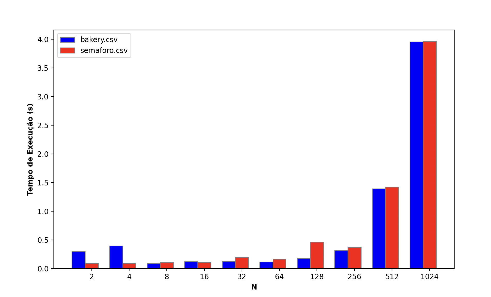
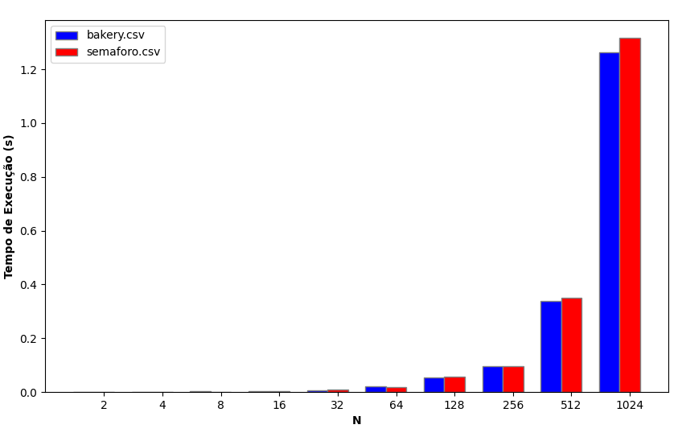

# ProjetoConcorrente
Alunos: Carlos ALberto Pamplona Filho / Gabriel Rodrigues Oliveira Lacerda

# Metodologia
O objetivo deste trabalho, referente à disciplina de programação concorrente do período de 2023-1, consiste em entender a execução de programas de maneira concorrente na linguagem RUST, e, a partir disso, avaliar a diferença de performance entre algoritmo de backary e o uso de semáforos como estratégias de implementação das travas, em problemas com diferentes tamanhos de entrada.
Para avaliar o desempenho, a partir de também diferentes números de threads. A partir disso, analisamos os tempos de execução do código, monitorando sua performance.

# Análise dos resultados

## Para macOS M2
- Processador CPU de 8 núcleos (4 de desempenho e 4 de eficiência)
- 8 gb memória RAM
- 512 gb dísco (ssd)

### Bakery
| Número de Threads | Tempo de execução |
| -- | -- |
| 2 |   0m0.302s  |
| 4 |   0m0.395s  |
| 6 |   0m0.092s  |
| 16|   0m0.120s  |
| 32|   0m0.132s  |
| 64|   0m0.117s  |
|128|   0m0.182s  |
|256|   0m0.320s  |
|512|   0m1.392s  |
|1024|  0m3.955s  |

### Semáforo
| Número de Threads | Tempo de execução |
| -- | -- |
| 2 |  0m0.095s   |
| 4 |  0m0.095s   |
| 6 |  0m0.106s   |
| 16|  0m0.112s   |
| 32|  0m0.198s   |
| 64|  0m0.166s   |
|128|  0m0.464s   |
|256|  0m0.375s   |
|512|  0m1.425s   |
|1024|  0m3.965s  |

| Gráfico de comparação entre resultados |
|--|
|

## Para Intel© Core™ i5-10300H CPU @ 2.50GHz
- Processador com quatro núcleos físicos e 8 núcleos lógicos.
- 16 GB de memória RAM 
- 768.2 GB de disco (ssd)

### Bakery

| Número de Threads | Tempo de execução |
| -- | -- |
| 2 | 0m0,001s |
| 4 | 0m0,001s |
| 8 | 0m0,002s |
| 16| 0m0,003s |
| 32|0m0,007s  |
| 64|0m0,019s  |
|128|0m0,054s  |
|256|0m0,104s  |
|512|0m0,346s  |
|1024|0m1,302s |

### Semáforo

| Número de Threads | Tempo de execução |
| -- | -- |
| 2 | 0m0,001s |
| 4 | 0m0,001s |
| 8 | 0m0,002s |
| 16| 0m0,003s |
| 32|0m0,007s  |
| 64|0m0,020s  |
|128|0m0,056s  |
|256|0m0,100s  |
|512|0m0,352s  |
|1024|0m1,316s |

| Gráfico de comparação entre resultados |
|--|
|

# Conclusão

Durante os experimentos realizados acima descritos, com o código provido, obtivemos um resultado que favorece o algorítmo de bakery sob situações em que temos um número maior de threads (no nosso caso, para uma quantificação de até 1024 valores). Entretanto, ao prover um recurso mais poderoso em processamento de CPU (analisar resultados do i5 10300H), obtivemos resultados muito semelhantes, que ficam dentro de uma margem de erro de 5%, podendo-se considerar o resultado equivalente.
